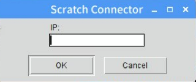
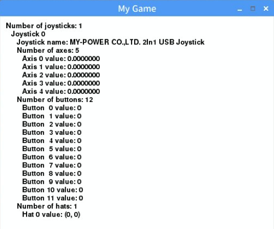

# gamepad-tester
to use gamepads in Python with pygame and pygame zero, or in Scratch

## How to use

1. Connect your gamepad to your computer via USB. Gamepad for PS: Play Station or SNES, or SNES: Super Nintendo Entertainment System can be used.
2. Launch Scratch 1.4, then turn on the Scratch Remote Sensors Connection.
3. Launch Python2 code 'test-scratch.py' by  ```python2 test-scratch.py``` in the LXTerminal window.
4. Tkinter dialog wondow pops up to locate the Scratch to connect to.  [](images/Scratch-Connecter.png)
5. Just hit Enter or OK to connect the python code to the Scratch running on your computer.
6. New window pops up for the status of your gamepad connected to your computer via USB.  [](images/Gamepad-Status.png)


Python3 compatible Scratch-RSP test code is [here](https://github.com/Naohiro2g/rsp-test).


# Reference to Scratch Remote Sensors Protovol

Newer versions of Scratch-RSP test code in Python3
https://github.com/Naohiro2g/rsp-test

Remote Sensors Protocol (Scratch 1.4)
https://en.scratch-wiki.info/wiki/Remote_Sensors_Protocol

Code in Python 2
https://en.scratch-wiki.info/wiki/Communicating_to_Scratch_via_Python_with_a_GUI

Code in Python 3
https://en.scratch-wiki.info/wiki/Communicating_to_Scratch_via_Python
